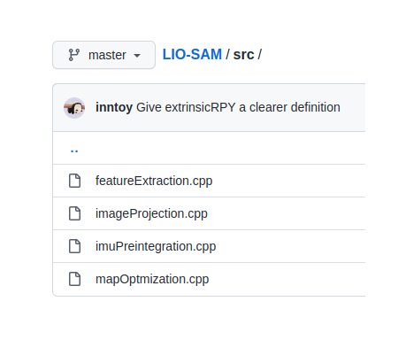
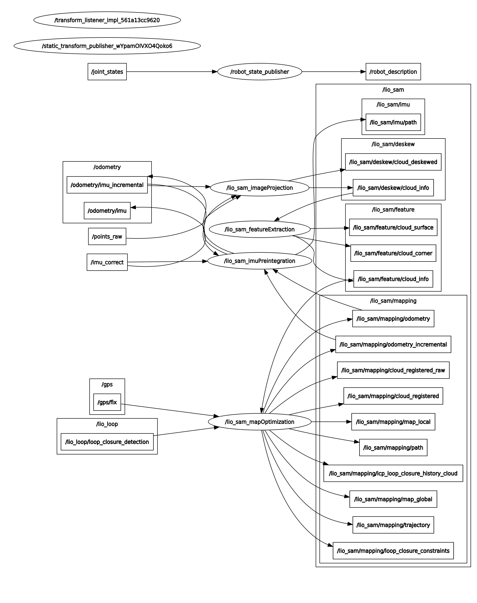
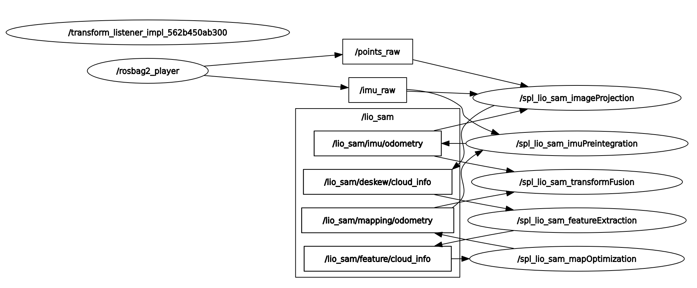
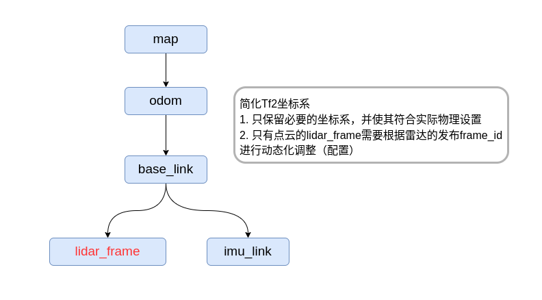
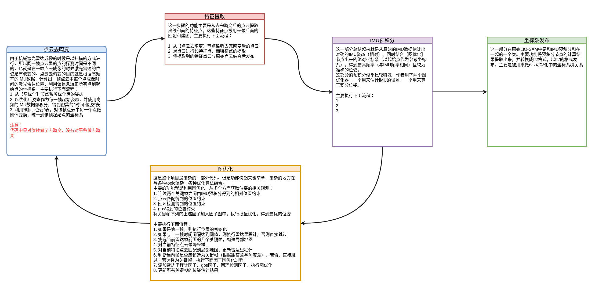
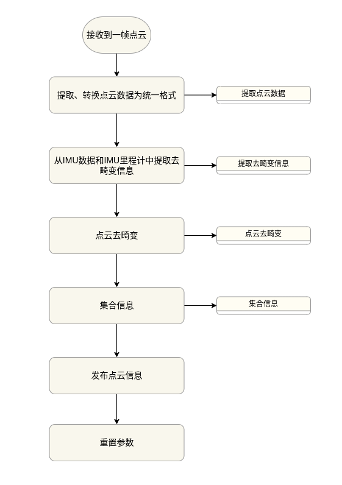
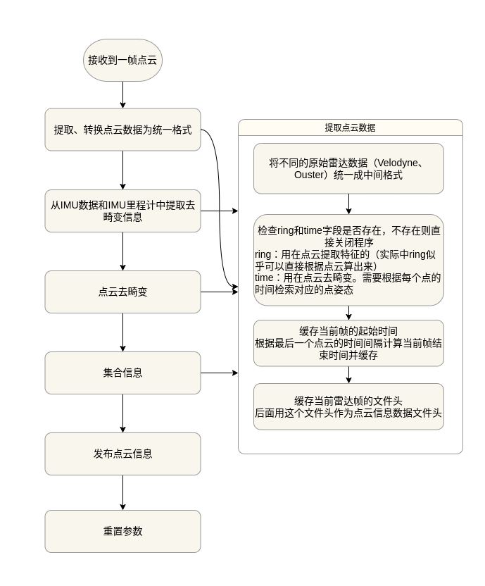

## 本项目目的及特点介绍
[LIOSAM]源代码虽然不能说庞大，甚至可以说简单，因为整个代码库主要就是那5个文件。


但是里面每个模块都通过ROS的topic与其他模块有紧密的联系。
整个的流程对新手十分不友好，下图是[LIOSAM]原本运行时的`rqt_graph`




第二个复杂之处在与LIOSAM框架涉及到的知识点和工具较多，至少要熟悉`ROS,gtsam,pcl`几个库，算法层面需要熟悉`点云匹配、IMU积分、因子图、三维转换`等。对于熟悉SLAM的人来说可能较为简单上手，但是对于新入门的人来说则一开始会一头雾水。

本项目对[LIOSAM]做了如下改进：

### 基于ROS2-humble实现
LIOSAM源码中的ros2分支长时间没有人维护，且该分支存在一些bug没有被修复。
所以本项目在LIOSAM的ros2分支基础上，修复了存在的bug，同时将`Transformfusion`类抽取成独立的文件。

为了便于上手及部署，本项目准备了适配的docker镜像供学习者使用。

### 简化
#### 话题发布的简化
[LIOSAM]原始代码中有很多中间结果的发布，这些中间结果可以用来可视化及调试程序，但是对于学习者和开发者而言不仅意义不大，而且会在初始学习源码阶段误导学习者。
本项目在话题发布上进行`大幅度简化`，简化后的设计如下：


简化后运行时的`rqt_graph`:


#### 坐标系简化
[LIOSAM]中实用的坐标系并不复杂，但是作者提供的`urdf`包含了太多为了兼容性考虑的坐标系，这些坐标系对于实际运行和理解并没有用。因此，本项目基于ROS对坐标系的约束，将坐标系关系树简化为如下：


#### 保留算法及定义完整性
虽然本项目去除了很多非必要话题，同时对于一些非必要代码也进行了简化，但对一些学习算法有帮助的细节依旧保留。比如激光里程计在发布的时候有`mapping/odometry`和`mapping/odometry_incremental`两个话题，两个话题虽然类似但是背后却有很不同的函数，但同时两者合一又不影响算法的运行。因此本项目采取的做法是在代码中保留这部分代码，同时加以解释，但发布时只发布其中一个话题。

### 完善的注释及流程图
本项目进行了完善的注释，并总结了算法流程。

为了最为清晰的展示[LIOSAM]算法不同模块的流程，该项目还对各个模块流程进行梳理，建立了完善的流程图设计




### 成员变量的命名修改
原来的命名方式：
```
    lio_sam_op::msg::CloudInfo cloudInfo;
```

修改后：
```
    lio_sam_op::msg::CloudInfo cloudInfo_;  
	// 加了下划线，区分是不是成员变量
```


## 运行环境搭建

本项目基于`ROS2-humble`环境。

### 数据

本项目同时提供转为`rosbag2`格式的数据包
链接：https://pan.baidu.com/s/1hhHvn96uEsDYJNss3Z209Q 
提取码：2478

```bash
export DATA_DIR=/path/to/download/ros2bag/dir
```
本项目中默认的配置文件`params_default.yaml`可以直接运行下面的数据：
- park_dataset
- walking_dataset
- garden_dataset

### docker环境部署
docker编译与运行环境：
```bash
cd lio-sam-optimize
./docker_run.sh -h  # show help message
./docker_run.sh -c /path/to/code/repo -d $DATA_DIR

# ./docker_into.sh  # enter the container next time

cd lio-sam-optimize
./docker_into.sh

# 下面命令在镜像中执行
cd ~/ros_ws/
mkdir src && cd src &&ln -s /home/splsam/codes ./
cd ..
source /opt/ros/humble/setup.bash
colcon build --packages-select lio_sam_op
```

### 本地编译运行

编译本项目时候需要依赖cv_bridge包：

```bash
source /opt/surface/ros/humble/setup.bash
cd <YOUR_CODE_WORKSPACE>
colcon build --symlink-install

```
可能出现的错误：
```
Could not find a package configuration file provided by "cv_bridge" with any of the following names:

    cv_bridgeConfig.cmake
    cv_bridge-config.cmake
```
看看包里面有没有cv_bridge，编译成功没有，成功了就source本地环境，重新编译就行:
```
source  ./install/setup.bash
```


### 运行
```bash
# docker镜像下运行
cd ~/ros_ws
source ./install/setup.bash
ros2 launch lio_sam_op run.launch.py 

# 新开终端
cd lio-sam-optimize
./docker_into.sh
cd data/ros2/
ros2 bag play ./park_dataset/ --topics /points_raw /imu_raw
```

### 本地运行
先把本项目节点运行起来：
```
ros2 launch lio_sam_op run.launch.py 
```
然后播放数据：
```
ros2 bag play ./park_dataset/ --topics /points_raw /imu_raw
```

## 其他参考

作者Github:
https://github.com/TixiaoShan 

论文：https://arxiv.org/abs/2007.00258


LIO-SAM-note:
https://github.com/chennuo0125-HIT/LIO-SAM-note

LIO-SAM-DetailedNote:
https://github.com/smilefacehh/LIO-SAM-DetailedNote 
